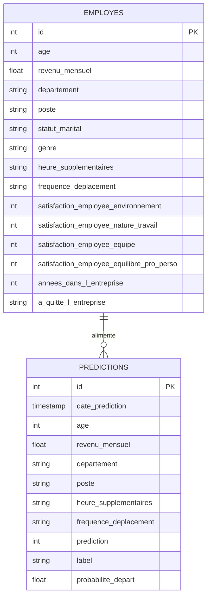

## 📋 Sommaire

- [API Attrition RH — Projet P5](#api-attrition-rh--projet-p5)
  - [Description](#description)
  - [Architecture](#architecture)
  - [Installation](#installation)
    - [Prérequis](#prérequis)
    - [Étapes](#étapes)
  - [Lancement](#lancement)
  - [📡Endpoints](#endpoints)
  - [Authentification](#authentification)
  - [Sécurité](#sécurité)
  - [Exemple d'utilisation](#exemple-dutilisation)
  - [Modèle-de-données--schéma-uml](#modèle-de-données--schéma-uml)
    - [Structure des tables](#structure-des-tables)
    - [Processus de stockage](#processus-de-stockage)
  - [Tests](#tests)
- [P5 - Déploiement ML - Attrition RH](#p5---déploiement-ml---attrition-rh)
  - [🌐 Déploiement en ligne](#-déploiement-en-ligne)
  - [CI/CD](#cicd)
  - [Gestion des versions](#gestion-des-versions)
  - [Mise à jour du modèle](#mise-à-jour-du-modèle)
  - [Stack technique](#stack-technique)


# API Attrition RH — Projet P5

Déploiement d'un modèle de Machine Learning pour prédire le risque de départ des employés chez Technova

##  Description

Ce projet expose un modèle de **Régression Logistique** via une API REST FastAPI. Chaque prédiction est enregistrée dans une base PostgreSQL pour assurer une traçabilité complète des interactions.

**Modèle** : Logistic Regression (scikit-learn) avec StandardScaler
**Objectif** : Prédire si un employé va quitter l'entreprise (classification binaire)  
**Dataset** : 1470 employés, 37 features


## Architecture

```
p5/
├── api/
│   └── main.py              # API FastAPI
├── database/
│   ├── create_db.py         # Création des tables
│   ├── insert_data.py       # Insertion du dataset
│   └── db.py                # Connexion SQLAlchemy
├── models/                  # Fichiers .joblib (non versionnés)
├── notebooks/               # Notebook d'entraînement
├── tests/                   # Tests unitaires pytest
├── .env.example             # Template des variables d'environnement
└── .github/workflows/       # CI/CD GitHub Actions
├── requirements.txt          # Dépendances Python
└── README.md
```

##  Installation

### Prérequis
- Python 3.11+
- PostgreSQL 16+
- uv (gestionnaire de paquets)


### Étapes
```bash
# 1. Cloner le repo
git clone https://github.com/vler0ux/p5-ml-deployment.git
cd p5-ml-deployment

# 2. Installer les dépendances
uv sync

# 3. Configurer les variables d'environnement
cp .env.example .env
# Éditer .env avec vos valeurs

# 4. Configurer PostgreSQL
sudo -u postgres psql
```

```sql
CREATE DATABASE attrition_db;
CREATE USER attrition_user WITH PASSWORD 'votre_mot_de_passe';
GRANT ALL PRIVILEGES ON DATABASE attrition_db TO attrition_user;
GRANT ALL ON SCHEMA public TO attrition_user;
\q
```

```bash
# 5. Créer les tables
uv run python database/create_db.py

# 6. Insérer le dataset
uv run python database/insert_data.py

# 7. Générer le modèle (exécuter le notebook)
uv run jupyter lab notebooks/02_modelisation.ipynb
```

## Lancement

```bash
uv run uvicorn api.main:app --reload
```

- API : `http://localhost:8000`
- Documentation Swagger : `http://localhost:8000/docs`

## 📡Endpoints

| Méthode | Endpoint | Auth | Description |
|---------|----------|------|-------------|
| GET | `/` | ❌ | Message de bienvenue |
| GET | `/health` | ❌ | Statut de l'API |
| POST | `/predict` | ✅ | Prédiction de départ |

##  Authentification

L'endpoint `/predict` est protégé par une **API Key**.

Ajoute le header suivant à chaque requête :
```
X-API-Key: votre_cle_api
```

Dans Swagger, clique sur le cadenas 🔒 en haut à droite et entre ta clé.

## Sécurité

- Les secrets (API Key, mot de passe BDD) sont stockés dans `.env` (jamais versionné)
- `.env.example` documente les variables nécessaires sans exposer les valeurs
- Les fichiers `.joblib` ne sont pas versionnés (trop lourds et régénérables)
- L'accès à la BDD est limité à un utilisateur dédié avec droits restreints

## Exemple d'utilisation

```bash
curl -X POST "http://localhost:8000/predict" \
  -H "Content-Type: application/json" \
  -H "X-API-Key: votre_cle_api" \
  -d '{
    "age": 28,
    "revenu_mensuel": 3000,
    "heure_supplementaires": "Oui",
    "satisfaction_employee_environnement": 1,
    "frequence_deplacement": "Frequent"
  }'
```

Réponse :
```json
{
  "prediction": 1,
  "label": "Risque de départ",
  "probabilite_depart": 0.74
}
```

## Modèle-de-données--schéma-uml



> Les inputs envoyés à l'API `/predict` suivent le même schéma que la table `employes`.  
> Chaque appel est automatiquement enregistré dans `predictions` avec le résultat du modèle.

### Structure des tables

**Table `employes`** : dataset complet (1470 lignes)
| Colonne | Type | Description |
|---------|------|-------------|
| id | INTEGER | Clé primaire |
| age | INTEGER | Âge de l'employé |
| revenu_mensuel | FLOAT | Salaire mensuel |
| departement | VARCHAR | Département |
| a_quitte_l_entreprise | VARCHAR | Valeur réelle (Oui/Non) |

**Table `predictions`** : historique des prédictions
| Colonne | Type | Description |
|---------|------|-------------|
| id | INTEGER | Clé primaire |
| date_prediction | DATETIME | Horodatage automatique |
| age | INTEGER | Âge soumis |
| revenu_mensuel | FLOAT | Salaire mensuel soumis |
| departement | VARCHAR | Département soumis |
| poste | VARCHAR | Poste soumis |
| heure_supplementaires | VARCHAR | Heures sup (Oui/Non) |
| frequence_deplacement | VARCHAR | Fréquence déplacement |
| prediction | INTEGER | 0=stable, 1=départ |
| label | VARCHAR | "Employé stable" / "Risque de départ" |
| probabilite_depart | FLOAT | Score de probabilité [0-1] |

### Processus de stockage
Chaque appel à `/predict` enregistre automatiquement les inputs et outputs dans la table `predictions` via SQLAlchemy, assurant une traçabilité complète.

## Tests

```bash
uv run pytest tests/ -v --cov=api --cov-report=html
```

Le rapport de couverture est généré dans `htmlcov/`.


# P5 - Déploiement ML - Attrition RH

API de prédiction d'attrition des employés développée avec FastAPI.

## 🌐 Déploiement en ligne

L'API est déployée sur Hugging Face Spaces :  
**URL** : https://vler0ux-p5-ml-deployment.hf.space

- Documentation Swagger : https://vler0ux-p5-ml-deployment.hf.space/docs
- Sur le plan gratuit, le Space s'endort après 48h d'inactivité et se réveille automatiquement au premier accès (30-60 secondes).

## CI/CD

Le pipeline GitHub Actions (`.github/workflows/ci.yml`) :
- S'exécute à chaque push
- Lance les tests automatiquement
- Gère les environnements dev et prod via les secrets GitHub

## Gestion des versions

| Branche | Rôle |
|---------|------|
| `main` | Production |
| `develop` | Intégration |
| `feature/*` | Nouvelles fonctionnalités |

Les versions de production sont taguées (`v1.0.0`).


## Mise à jour du modèle

1. Réentraîner dans le notebook
2. Exporter `model.joblib` dans `models/`
3. Créer une branche `feature/update-model`
4. Vérifier que les tests passent
5. Merger sur `main` → déploiement automatique

## Stack technique

| Outil | Usage |
|-------|-------|
| FastAPI | API REST |
| Pydantic | Validation des données |
| scikit-learn | Modèle ML |
| PostgreSQL | Base de données |
| SQLAlchemy | ORM |
| uv | Gestionnaire de paquets |
| pytest | Tests unitaires |
| GitHub Actions | CI/CD |

